# Development Workflow

This document explains the recommended team workflow for PLC development using **cds-text-sync**.

## Overview

The workflow is designed to combine the robustness of CODESYS for hardware configuration and HMI development with the power of modern Git-based version control for logic development.

## 1. Project Initialization

Before the team can start working, the project must be prepared:

1.  **Export Project**: The initial state of the CODESYS project is exported using `Project_export.py`. This generates `.st` files in the `/src` folder for all POUs, GVLs, and DUTs.
2.  **Initialize Repository**: A Git repository is created, and the source files (and optionally the `.project` binary using LFS) are pushed to a remote server (e.g., GitHub, GitLab).

## 2. Team Roles

### 🔧 HMI / Hardware Engineer (Main Branch Owner)

- **Role**: Acts as the gatekeeper of the project.
- **Responsibilities**:
  - Maintains the integrity of the Hardware Configuration and HMI.
  - Manages the `main` branch.
  - Reviews incoming Pull Requests from developers.
  - Ensures that merged logic is compatible with the physical hardware.

### 👨‍💻 Development Team (Engineers)

- **Role**: Implement features and fix bugs.
- **Responsibilities**:
  - Clone the project to their local machines.
  - Develop logic using external editors or CODESYS.
  - Sync changes and submit them for review via Pull Requests.

## 3. The Development Cycle

For every new task (Feature or Bug Fix), developers follow these steps:

1.  **Clone / Sync**: Clone the repository or `git pull` the latest changes from `main`.
2.  **Make Changes**: Open the CODESYS project and implement the required logic.
3.  **Export to Text**: Run `Project_export.py` to update the `.st` files on the disk with the new CODESYS state.
4.  **Commit & Push**: Use Git to commit the updated source files and push them to a dedicated **feature branch**.
5.  **Create Pull Request**: Open a Pull Request (PR) to merge the feature branch into `main`.

## 4. Code Review & Integration

1.  **Review**: The Main Branch Owner reviews the code changes.
2.  **Approval**:
    - **Yes**: If the code is correct and follows standards, it is merged into `main`.
    - **No**: If revisions are needed, feedback is provided, and the developer returns to the "Make Changes" step in the development cycle.
3.  **Team Sync**: Once merged, all other team members can pull the updated `main` branch into their local environments.
